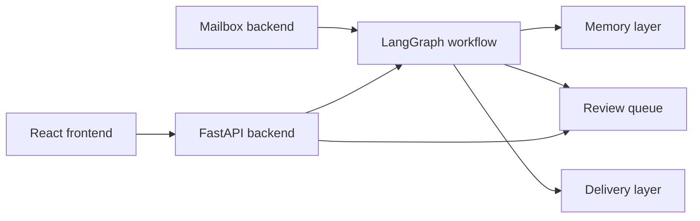
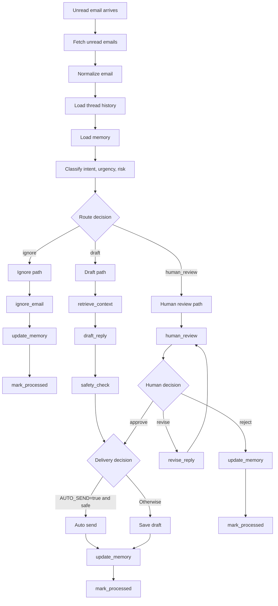

# AI Email Agent

A full-stack AI email workflow system built with Python, LangGraph, FastAPI, React, Gmail API, and MongoDB-ready memory.

The project reads unread emails, understands thread context, classifies intent and risk, routes messages into ignore, draft, or human-review paths, and exposes the whole workflow through a web dashboard.

## Overview

This project is designed as a workflow-driven email agent rather than a single prompt wrapper. It combines:

- a mailbox layer that supports local demo data, Gmail API, and IMAP/SMTP
- a LangGraph state machine for email execution
- human-in-the-loop review with approve, revise, and reject actions
- a FastAPI backend for triggering runs and reading live state
- a React frontend for monitoring execution, inspecting messages, and reviewing decisions

The current project is a strong working MVP / V2-style build for learning, demos, and further extension.

## Features

- Gmail API email processing with OAuth
- local demo backend for safe testing
- IMAP/SMTP fallback support
- newest-first unread email handling
- thread-aware context loading
- intent, urgency, and risk classification
- explicit workflow routing with LangGraph
- automated draft generation
- safety checks before delivery
- human review queue with approve / revise / reject actions
- resumable review flow for newer review items
- FastAPI backend with dashboard, run, review, and progress APIs
- React dashboard with separate pages for dashboard, execution, flow, and diagram views
- live node-by-node execution progress UI
- visual execution flowchart and exported PDF diagrams in [docs](C:\Users\satya\Desktop\Email-agent\docs)
- Mongo-ready memory scaffolding for contacts, threads, drafts, and reviews

## Tech Stack

- Backend: Python, FastAPI
- Workflow: LangGraph
- LLM: LangChain OpenAI
- Frontend: React, Vite
- Email: Gmail API, IMAP/SMTP, local JSON demo inbox
- Database / memory: MongoDB
- Testing: Python `unittest`

## Architecture



## Execution Flow



Top-level routes:

- `ignore`: newsletters, spam, or irrelevant emails
- `draft`: replyable low-risk emails
- `human_review`: sensitive, ambiguous, or reviewer-required emails

Important detail:

- `auto send` is not a top-level route
- it is a delivery outcome inside the `draft` path after safety checks

## Project Structure

```text
email-agent/
├─ data/
├─ docs/
├─ frontend/
│  ├─ src/
│  │  ├─ components/
│  │  ├─ lib/
│  │  ├─ pages/
│  │  └─ styles/
├─ src/
│  └─ email_agent/
│     ├─ api/
│     ├─ db/
│     ├─ graph/
│     │  └─ nodes/
│     ├─ llm/
│     ├─ models/
│     ├─ services/
│     ├─ config.py
│     ├─ mailbox.py
│     └─ main.py
├─ tests/
├─ .env.example
├─ pyproject.toml
└─ README.md
```

## Main Pages

The frontend includes separate pages for:

- `Dashboard`: operational overview, inbox snapshot, review queue, detail panel
- `Execution`: live node-by-node run progress for each email
- `Flow`: explanation-focused workflow view
- `Diagram`: visual execution flowchart view

## Backend API

Main API routes in [app.py](C:\Users\satya\Desktop\Email-agent\src\email_agent\api\app.py):

- `GET /api/health`
- `GET /api/dashboard`
- `GET /api/progress`
- `GET /api/reviews`
- `POST /api/run`
- `POST /api/reviews/{review_id}/approve`
- `POST /api/reviews/{review_id}/revise`
- `POST /api/reviews/{review_id}/reject`

## Getting Started

### 1. Create a virtual environment

Windows:

```powershell
py -3.11 -m venv .venv
.venv\Scripts\Activate.ps1
```

macOS / Linux:

```bash
python3 -m venv .venv
source .venv/bin/activate
```

### 2. Install backend dependencies

```bash
pip install -e .
```

### 3. Configure environment variables

Copy [.env.example](C:\Users\satya\Desktop\Email-agent\.env.example) to `.env`:

```powershell
Copy-Item .env.example .env
```

Then update the values you need.

Minimum local setup:

- `OPENAI_API_KEY`
- `EMAIL_BACKEND=local`

Optional:

- `MONGODB_URI` for Mongo-backed memory
- Gmail OAuth settings for Gmail mode
- IMAP/SMTP settings for generic mailbox mode

## Running the Project

### Run the CLI agent

```bash
email-agent
```

or:

```bash
python -m email_agent
```

Useful flags:

```bash
python -m email_agent --limit 3
python -m email_agent --show-body
```

### Run the backend API

```bash
email-agent-api
```

or:

```bash
python -m uvicorn email_agent.api.app:app --reload
```

Backend URL:

- [http://127.0.0.1:8000](http://127.0.0.1:8000)

Useful endpoints:

- [http://127.0.0.1:8000/api/health](http://127.0.0.1:8000/api/health)
- [http://127.0.0.1:8000/api/dashboard](http://127.0.0.1:8000/api/dashboard)
- [http://127.0.0.1:8000/api/progress](http://127.0.0.1:8000/api/progress)

### Run the frontend

```bash
cd frontend
npm install
npm run dev
```

Frontend URL:

- [http://127.0.0.1:5173](http://127.0.0.1:5173)

### Run tests

```bash
python -m unittest discover -s tests -v
```

### Build the frontend

```bash
cd frontend
npm run build
```

## Backend Modes

### Local demo mode

Uses JSON files for safe experimentation.

- inbox: [sample_inbox.json](C:\Users\satya\Desktop\Email-agent\data\sample_inbox.json)
- outbox: [outbox.json](C:\Users\satya\Desktop\Email-agent\data\outbox.json)
- review queue: [review_queue.json](C:\Users\satya\Desktop\Email-agent\data\review_queue.json)
- last run snapshot: [last_run.json](C:\Users\satya\Desktop\Email-agent\data\last_run.json)

Recommended for first-time testing.

### Gmail mode

Uses the Gmail API instead of IMAP/SMTP.

Capabilities:

- reads unread Gmail inbox messages
- preserves Gmail thread IDs
- creates native Gmail drafts
- sends Gmail replies
- removes `UNREAD` after processing
- applies outcome labels such as `AI-Ignored`, `AI-Drafted`, `AI-Sent`, and `AI-Needs-Human`

Suggested `.env` values:

```env
EMAIL_BACKEND=gmail
GMAIL_USER_ID=me
GMAIL_CREDENTIALS_PATH=credentials.json
GMAIL_TOKEN_PATH=data/gmail_token.json
AUTO_SEND=false
GMAIL_LABEL_PREFIX=AI
```

To use Gmail mode:

1. Enable the Gmail API in Google Cloud.
2. Create an OAuth Desktop App client.
3. Download `credentials.json` into the project root.
4. Run the app once and complete OAuth consent.
5. Let the app create `data/gmail_token.json`.

### IMAP/SMTP mode

Useful for generic mailbox integration when Gmail API is not the target.

## Human Review Workflow

The review system supports:

- `approve`: resume the saved review state and continue delivery
- `revise`: regenerate the draft from reviewer comments and keep it pending
- `reject`: close the item without sending

Important note:

- newer review items support full resume behavior
- legacy review items may only support status updates if they were created before state snapshots were added

## Visual Docs

The project includes exported workflow diagrams in [docs](C:\Users\satya\Desktop\Email-agent\docs):

- [execution_flowchart.html](C:\Users\satya\Desktop\Email-agent\docs\execution_flowchart.html)
- [execution_flowchart.pdf](C:\Users\satya\Desktop\Email-agent\docs\execution_flowchart.pdf)
- [execution_flowchart_visual.pdf](C:\Users\satya\Desktop\Email-agent\docs\execution_flowchart_visual.pdf)

## Key Files To Understand

If you want to learn the codebase quickly, read these first:

- [main.py](C:\Users\satya\Desktop\Email-agent\src\email_agent\main.py)
- [mailbox.py](C:\Users\satya\Desktop\Email-agent\src\email_agent\mailbox.py)
- [builder.py](C:\Users\satya\Desktop\Email-agent\src\email_agent\graph\builder.py)
- [routes.py](C:\Users\satya\Desktop\Email-agent\src\email_agent\graph\routes.py)
- [human_review.py](C:\Users\satya\Desktop\Email-agent\src\email_agent\graph\nodes\human_review.py)
- [review_resume_service.py](C:\Users\satya\Desktop\Email-agent\src\email_agent\services\review_resume_service.py)
- [app.py](C:\Users\satya\Desktop\Email-agent\src\email_agent\api\app.py)
- [DashboardPage.jsx](C:\Users\satya\Desktop\Email-agent\frontend\src\pages\DashboardPage.jsx)

## Why This Project Is Interesting

This repo demonstrates:

- workflow-based AI application design
- safe LLM routing instead of blind auto-send
- mailbox abstraction across providers
- human-in-the-loop review
- thread-aware email handling
- a full-stack control plane around an agentic backend

## Current Status

This project is complete as a strong working MVP / V2-style product for:

- portfolio projects
- demos
- learning LangGraph and workflow orchestration
- experimenting with Gmail-connected AI workflows

It is not positioned yet as a fully deployed enterprise SaaS.

## Future Improvements

- scheduler / background worker
- richer Mongo memory learning
- attachment parsing
- audit and analytics views
- Docker and deployment setup
- Microsoft Graph / Outlook support

## Resume / Portfolio Summary

Built a full-stack AI Email Agent using Python, LangGraph, FastAPI, React, Gmail API, and MongoDB-ready memory for thread-aware email processing, automated drafting, human review, resumable workflow actions, and live operational monitoring.
