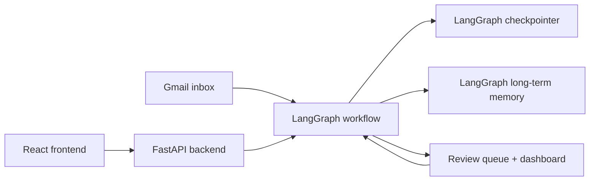
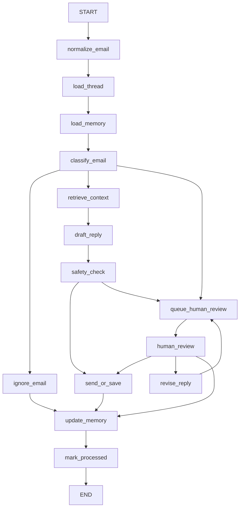

# Gmail AI Email Agent

A Gmail-first AI email workflow built with Python, LangGraph, FastAPI, React, and MongoDB-backed LangGraph persistence.

The project reads unread Gmail messages, loads Gmail thread history, classifies intent and risk, drafts replies, pauses natively for human review with LangGraph `interrupt(...)`, and resumes from the saved checkpoint when the reviewer approves, revises, or rejects.

## What It Does

- Reads unread emails from Gmail with the Gmail API
- Preserves Gmail `thread_id` for thread-aware processing
- Runs the workflow node by node in LangGraph
- Drafts replies with OpenAI models
- Runs a safety check before delivery
- Uses native LangGraph human-in-the-loop pause/resume
- Saves long-term memory in LangGraph Mongo store
- Uses semantic search over long-term memory when embeddings are configured
- Exposes a FastAPI backend and React dashboard for execution and review

## Current Stack

- Backend: Python, FastAPI
- Workflow: LangGraph
- LLM: LangChain OpenAI
- Mailbox: Gmail API
- Short-term memory: LangGraph MongoDB checkpointer
- Long-term memory: LangGraph Mongo store
- Frontend: React + Vite
- Tests: Python `unittest`

## High-Level Architecture



## Workflow



## Human Review Flow

The graph uses native LangGraph human-in-the-loop behavior.

1. `queue_human_review` creates or refreshes the dashboard review item.
2. `human_review` calls `interrupt(...)`.
3. LangGraph saves the workflow state in the checkpointer.
4. The dashboard calls the backend review API.
5. The backend resumes the same graph with `Command(resume=...)`.

Approve path:

```text
human_review -> send_or_save -> update_memory -> mark_processed
```

Revise path:

```text
human_review -> revise_reply -> queue_human_review -> human_review
```

Reject path:

```text
human_review -> update_memory -> mark_processed
```

## Memory Design

### Short-Term Memory

Short-term memory is the LangGraph checkpointer.

It stores:

- current graph state
- node outputs
- pause/resume state for human review

Each email run is invoked with:

```text
thread_id = email.id
```

That lets LangGraph restore the exact paused workflow later.

### Long-Term Memory

Long-term memory is stored through the LangGraph Mongo store adapter.

Reusable namespaces:

- `contacts`
- `threads`
- `reply_examples`
- `business_facts`

History namespaces:

- `review_history`
- `draft_history`

Only compact reusable memory is loaded back into `state["memory"]`.
Detailed history stays stored for audit and traceability.

### Semantic Search

When embeddings are configured, long-term memory retrieval uses semantic search for:

- `reply_examples`
- `business_facts`

This helps the agent retrieve relevant past replies and facts using the current email subject/body as the search query instead of only exact matching.

### LLM Memory Update

Long-term memory updates are not only manual now.

After a run finishes, the memory layer can use the LLM to extract:

- sender importance
- sender preferences
- sender notes
- compact thread summary
- durable business facts

Those extracted memory updates are merged with previously stored long-term memory before saving.

## Environment Variables

Copy [.env.example](C:\Users\satya\Desktop\Email-agent\.env.example) to `.env`.

Required:

- `OPENAI_API_KEY`
- `GMAIL_CREDENTIALS_PATH`

Important options:

```env
OPENAI_API_KEY=your_openai_api_key
OPENAI_MODEL=gpt-4.1-mini
OPENAI_EMBEDDING_MODEL=text-embedding-3-small
OPENAI_EMBEDDING_DIMENSIONS=1536

AUTO_SEND=false
MAX_EMAILS=5

GMAIL_USER_ID=me
GMAIL_CREDENTIALS_PATH=credentials.json
GMAIL_TOKEN_PATH=data/gmail_token.json
GMAIL_OPEN_BROWSER=false
GMAIL_LABEL_PREFIX=AI

MONGODB_URI=
MONGODB_DATABASE=email_agent
MONGODB_STORE_COLLECTION=long_term_memory
MONGODB_MEMORY_NAMESPACE=email_agent
```

Notes:

- `AUTO_SEND=false` means replies are saved as drafts unless you explicitly enable sending.
- If `MONGODB_URI` is empty, the app falls back to in-memory LangGraph storage.
- Gmail OAuth token is stored at `data/gmail_token.json`.

## Installation

### Backend

```powershell
python -m venv .venv
.venv\Scripts\Activate.ps1
pip install -e .
```

### Frontend

```powershell
cd frontend
npm install
```

## Running

### CLI

```powershell
email-agent
```

Useful flags:

```powershell
email-agent --limit 3
email-agent --show-body
```

### Backend API

```powershell
email-agent-api
```

or

```powershell
python -m uvicorn email_agent.api.app:app --reload
```

Backend URL:

- [http://127.0.0.1:8000](http://127.0.0.1:8000)

### Frontend

```powershell
cd frontend
npm run dev
```

Frontend URL:

- [http://127.0.0.1:5173](http://127.0.0.1:5173)

## API Endpoints

Main routes in [app.py](C:\Users\satya\Desktop\Email-agent\src\email_agent\api\app.py):

- `GET /api/health`
- `GET /api/dashboard`
- `GET /api/progress`
- `GET /api/reviews`
- `POST /api/run`
- `POST /api/reviews/{review_id}/approve`
- `POST /api/reviews/{review_id}/revise`
- `POST /api/reviews/{review_id}/reject`

## Dashboard Data Files

The app still keeps a few local operational files:

- `data/review_queue.json`
- `data/run_progress.json`
- `data/last_run.json`

These support the dashboard and review queue UI.

## Project Structure

```text
email-agent/
|-- data/
|-- frontend/
|   |-- src/
|-- src/
|   |-- email_agent/
|   |   |-- api/
|   |   |-- db/
|   |   |-- graph/
|   |   |   |-- nodes/
|   |   |-- llm/
|   |   |-- models/
|   |   |-- services/
|   |   |-- config.py
|   |   |-- mailbox.py
|   |   `-- main.py
|-- tests/
|-- .env.example
|-- pyproject.toml
`-- README.md
```

## Key Files

If you want to understand the project quickly, start here:

- [mailbox.py](C:\Users\satya\Desktop\Email-agent\src\email_agent\mailbox.py)
- [builder.py](C:\Users\satya\Desktop\Email-agent\src\email_agent\graph\builder.py)
- [state.py](C:\Users\satya\Desktop\Email-agent\src\email_agent\graph\state.py)
- [human_review.py](C:\Users\satya\Desktop\Email-agent\src\email_agent\graph\nodes\human_review.py)
- [queue_human_review.py](C:\Users\satya\Desktop\Email-agent\src\email_agent\graph\nodes\queue_human_review.py)
- [review_resume_service.py](C:\Users\satya\Desktop\Email-agent\src\email_agent\services\review_resume_service.py)
- [mongo.py](C:\Users\satya\Desktop\Email-agent\src\email_agent\db\mongo.py)
- [agent_service.py](C:\Users\satya\Desktop\Email-agent\src\email_agent\services\agent_service.py)
- [app.py](C:\Users\satya\Desktop\Email-agent\src\email_agent\api\app.py)

## Testing

Run the unit tests:

```powershell
python -m unittest discover -s tests -v
```

## Current Status

This repo is currently:

- Gmail-only
- LangGraph-native for human review pause/resume
- Mongo-ready for both short-term and long-term memory
- using semantic long-term memory retrieval when embeddings are available
- suitable for demos, portfolio work, and iterative product building

## Resume / Interview Summary

Built a Gmail-based AI email agent using Python, LangGraph, FastAPI, React, Gmail API, and MongoDB-backed LangGraph persistence for thread-aware processing, native human-in-the-loop review, resumable workflows, semantic long-term memory retrieval, and LLM-assisted memory updates.
