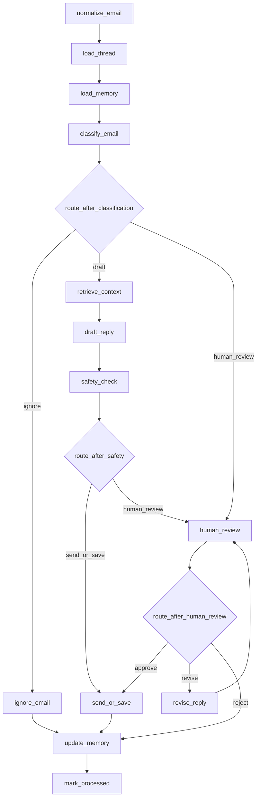

# Codebase Walkthrough From Entry Point

This guide explains how to understand the project starting from the real entry points and then following the code into the workflow, mailbox layer, review system, and frontend.

Use this when:

- you want to learn the repo quickly
- you want to explain the architecture in an interview
- you want to know where to debug when something breaks

## 1. Start With The Real Entry Points

This project has three practical entry points:

1. CLI agent run
2. FastAPI backend
3. React frontend

### CLI entry point

Start here:

- [__main__.py](C:\Users\satya\Desktop\Email-agent\src\email_agent\__main__.py)
- [main.py](C:\Users\satya\Desktop\Email-agent\src\email_agent\main.py)

Flow:

```text
python -m email_agent
-> __main__.py
-> main()
-> run_agent()
```

What `main()` does:

- parses CLI flags like `--limit` and `--show-body`
- calls `run_agent()` from the service layer
- prints the processed email results in terminal

### API entry point

Start here:

- [app.py](C:\Users\satya\Desktop\Email-agent\src\email_agent\api\app.py)

Flow:

```text
email-agent-api
-> FastAPI app
-> API routes
-> run_agent() / collect_dashboard_snapshot() / collect_progress_snapshot()
```

Important API routes:

- `GET /api/health`
- `GET /api/dashboard`
- `GET /api/progress`
- `GET /api/reviews`
- `POST /api/run`
- `POST /api/reviews/{review_id}/approve`
- `POST /api/reviews/{review_id}/revise`
- `POST /api/reviews/{review_id}/reject`

### Frontend entry point

Start here:

- [App.jsx](C:\Users\satya\Desktop\Email-agent\frontend\src\App.jsx)

This is the top-level React page switcher for:

- dashboard
- execution
- flow
- diagram

The frontend talks to the backend APIs and shows runtime state.

## 2. The Most Important Function In The Project

If you want one function that ties the project together, it is:

- [run_agent()](C:\Users\satya\Desktop\Email-agent\src\email_agent\services\agent_service.py)

This is the best place to understand the real execution lifecycle.

High-level flow inside `run_agent()`:

```text
load settings
-> build mailbox + memory + llm + graph
-> fetch unread emails
-> for each email:
   -> graph.invoke(...)
   -> collect result
   -> update progress
-> write last_run.json
-> return summary
```

Why it matters:

- CLI uses it
- API uses it
- live progress uses it
- dashboard data depends on it

So if you understand `run_agent()`, you understand the core backend behavior.

## 3. Runtime Setup

The runtime is built in:

- [_build_runtime()](C:\Users\satya\Desktop\Email-agent\src\email_agent\services\agent_service.py)

It creates:

- `settings` from [.env](C:\Users\satya\Desktop\Email-agent\.env)
- `mailbox` using [mailbox.py](C:\Users\satya\Desktop\Email-agent\src\email_agent\mailbox.py)
- `memory_store` using [mongo.py](C:\Users\satya\Desktop\Email-agent\src\email_agent\db\mongo.py)
- `llm` using `ChatOpenAI`
- `graph` using [builder.py](C:\Users\satya\Desktop\Email-agent\src\email_agent\graph\builder.py)

Configuration is loaded by:

- [config.py](C:\Users\satya\Desktop\Email-agent\src\email_agent\config.py)

Main config ideas:

- which email backend to use
- whether `AUTO_SEND` is enabled
- how many emails to process
- Gmail OAuth paths
- Mongo connection

## 4. Mailbox Layer: How Email Gets In And Out

The mailbox abstraction lives in:

- [mailbox.py](C:\Users\satya\Desktop\Email-agent\src\email_agent\mailbox.py)

This is the transport layer of the system.

The graph does not directly know whether email comes from:

- local JSON files
- Gmail API
- IMAP/SMTP

It only talks to the `MailboxClient` interface.

Core methods:

- `fetch_unread(limit)`
- `save_draft(original_email, draft)`
- `send_email(original_email, draft)`
- `fetch_thread_messages(thread_id, current_email_id)`
- `mark_processed(email_id, outcome=None)`
- `flag_for_human_review(original_email, reason, metadata=None)`

Available backends:

- `LocalMailboxClient`
- `GmailMailboxClient`
- `ImapSmtpMailboxClient`

How to read this file:

1. read the helper functions at the top
2. read the `MailboxClient` abstract interface
3. read `LocalMailboxClient` first because it is simplest
4. then read `GmailMailboxClient`

If you understand this file, you understand how the app fetches unread emails, loads thread history, saves drafts, sends emails, and marks emails processed.

## 5. The LangGraph Workflow

The workflow is assembled in:

- [builder.py](C:\Users\satya\Desktop\Email-agent\src\email_agent\graph\builder.py)

This file is where the graph is built node by node.

### What `build_email_graph()` does

It:

- creates the `StateGraph`
- registers all workflow nodes
- connects them with normal edges
- connects branch points with conditional edges
- compiles the graph

The nodes are:

- `normalize_email`
- `load_thread`
- `load_memory`
- `classify_email`
- `ignore_email`
- `retrieve_context`
- `draft_reply`
- `safety_check`
- `human_review`
- `revise_reply`
- `send_or_save`
- `update_memory`
- `mark_processed`

### Execution shape



## 6. Routing Logic

Routing rules live in:

- [routes.py](C:\Users\satya\Desktop\Email-agent\src\email_agent\graph\routes.py)

There are three routing functions:

- `route_after_classification`
- `route_after_safety`
- `route_after_human_review`

### `route_after_classification`

This is the first major branch point.

It decides:

- `ignore_email`
- `human_review`
- `retrieve_context`

Important rule:

- `classification.action == "ignore"` always routes to `ignore_email`

This is important because earlier, ignoring was too dependent on intent and that caused bad behavior.

### `route_after_safety`

This decides:

- `human_review`
- `send_or_save`

If the draft is not safe or needs a human, the email does not go directly to delivery.

### `route_after_human_review`

This decides:

- `send_or_save`
- `revise_reply`
- `update_memory`

That means a human review can:

- approve
- request changes
- reject

## 7. What Each Node Does

The nodes live in:

- [graph/nodes](C:\Users\satya\Desktop\Email-agent\src\email_agent\graph\nodes)

Read them in this order:

### 1. `normalize_email`

- [normalize_email.py](C:\Users\satya\Desktop\Email-agent\src\email_agent\graph\nodes\normalize_email.py)

Purpose:

- cleans and structures the raw email
- prepares normalized input for later steps

### 2. `load_thread`

- [load_thread.py](C:\Users\satya\Desktop\Email-agent\src\email_agent\graph\nodes\load_thread.py)

Purpose:

- loads earlier messages from the same thread
- creates `thread_messages`
- creates `thread_summary`

### 3. `load_memory`

- [load_memory.py](C:\Users\satya\Desktop\Email-agent\src\email_agent\graph\nodes\load_memory.py)

Purpose:

- loads longer-term memory from Mongo-backed storage

### 4. `classify_email`

- [classify_email.py](C:\Users\satya\Desktop\Email-agent\src\email_agent\graph\nodes\classify_email.py)

Purpose:

- classifies intent
- classifies urgency
- classifies risk
- decides an action

### 5. `ignore_email`

- [ignore_email.py](C:\Users\satya\Desktop\Email-agent\src\email_agent\graph\nodes\ignore_email.py)

Purpose:

- handles emails that should not get a reply

### 6. `retrieve_context`

- [retrieve_context.py](C:\Users\satya\Desktop\Email-agent\src\email_agent\graph\nodes\retrieve_context.py)

Purpose:

- collects prompt context before drafting
- includes memory and thread context

### 7. `draft_reply`

- [draft_reply.py](C:\Users\satya\Desktop\Email-agent\src\email_agent\graph\nodes\draft_reply.py)

Purpose:

- asks the model to create a reply draft

### 8. `safety_check`

- [safety_check.py](C:\Users\satya\Desktop\Email-agent\src\email_agent\graph\nodes\safety_check.py)

Purpose:

- decides whether the draft is safe to continue

### 9. `human_review`

- [human_review.py](C:\Users\satya\Desktop\Email-agent\src\email_agent\graph\nodes\human_review.py)

Purpose:

- creates a review item
- stores a `state_snapshot`
- returns a pending human decision

This node matters a lot because it saves the workflow state needed for later review resume.

### 10. `revise_reply`

- [revise_reply.py](C:\Users\satya\Desktop\Email-agent\src\email_agent\graph\nodes\revise_reply.py)

Purpose:

- rewrites the draft based on reviewer comments

### 11. `send_or_save`

- [send_or_save.py](C:\Users\satya\Desktop\Email-agent\src\email_agent\graph\nodes\send_or_save.py)

Purpose:

- decides final delivery outcome

Important behavior:

- if `AUTO_SEND=true` and safe, send
- otherwise save draft
- ignore safety guards also exist here so ignored emails are not accidentally sent

### 12. `update_memory`

- [update_memory.py](C:\Users\satya\Desktop\Email-agent\src\email_agent\graph\nodes\update_memory.py)

Purpose:

- persists the run outcome

### 13. `mark_processed`

- [mark_processed.py](C:\Users\satya\Desktop\Email-agent\src\email_agent\graph\nodes\mark_processed.py)

Purpose:

- updates mailbox state after the run is complete

## 8. Shared State: The Data Moving Through The Graph

Graph state is defined in:

- [state.py](C:\Users\satya\Desktop\Email-agent\src\email_agent\graph\state.py)

This is the contract that flows from node to node.

It contains values like:

- `email`
- `normalized_email`
- `thread_messages`
- `thread_summary`
- `memory`
- `retrieved_context`
- `classification`
- `draft`
- `safety_result`
- `human_decision`
- `delivery_status`
- `final_action`

This file is important because it tells you what data is supposed to exist at each stage.

## 9. Review System

Two main files matter here:

- [review_service.py](C:\Users\satya\Desktop\Email-agent\src\email_agent\services\review_service.py)
- [review_resume_service.py](C:\Users\satya\Desktop\Email-agent\src\email_agent\services\review_resume_service.py)

### `review_service.py`

Purpose:

- list review items
- normalize their structure
- help the dashboard render review state

### `review_resume_service.py`

Purpose:

- handle approve / revise / reject actions
- resume saved workflow state for new review items

This is the main file to read if you want to understand how human review continues the workflow after a user clicks a button.

## 10. Progress Tracking

Live progress behavior is mainly in:

- [agent_service.py](C:\Users\satya\Desktop\Email-agent\src\email_agent\services\agent_service.py)

Important pieces:

- `collect_progress_snapshot()`
- `_write_progress(...)`
- node execution tracking
- `NODE_EXECUTION_ORDER`

How it works:

- graph nodes are wrapped with `_wrap_node(...)` in [builder.py](C:\Users\satya\Desktop\Email-agent\src\email_agent\graph\builder.py)
- each node emits `start`, `complete`, or `error`
- `agent_service.py` writes those updates to [run_progress.json](C:\Users\satya\Desktop\Email-agent\data\run_progress.json)
- the frontend polls `/api/progress`

If you want to debug live execution UI issues, start with:

- [builder.py](C:\Users\satya\Desktop\Email-agent\src\email_agent\graph\builder.py)
- [agent_service.py](C:\Users\satya\Desktop\Email-agent\src\email_agent\services\agent_service.py)
- [ExecutionPage.jsx](C:\Users\satya\Desktop\Email-agent\frontend\src\pages\ExecutionPage.jsx)

## 11. Frontend Walkthrough

The frontend lives in:

- [frontend/src](C:\Users\satya\Desktop\Email-agent\frontend\src)

Best reading order:

1. [App.jsx](C:\Users\satya\Desktop\Email-agent\frontend\src\App.jsx)
2. [pages](C:\Users\satya\Desktop\Email-agent\frontend\src\pages)
3. [components](C:\Users\satya\Desktop\Email-agent\frontend\src\components)
4. [api.js](C:\Users\satya\Desktop\Email-agent\frontend\src\lib\api.js)

### Page responsibilities

- `DashboardPage`: overall operational view
- `ExecutionPage`: live execution details
- `FlowPage`: explanation-oriented workflow page
- `DiagramPage`: visual flowchart page

This means the frontend is not only a dashboard. It also acts as a documentation and debugging surface for the agent.

## 12. Where Data Is Stored

Useful runtime files in [data](C:\Users\satya\Desktop\Email-agent\data):

- [sample_inbox.json](C:\Users\satya\Desktop\Email-agent\data\sample_inbox.json): local test inbox
- [outbox.json](C:\Users\satya\Desktop\Email-agent\data\outbox.json): local drafts / sends
- [review_queue.json](C:\Users\satya\Desktop\Email-agent\data\review_queue.json): pending review items
- [last_run.json](C:\Users\satya\Desktop\Email-agent\data\last_run.json): latest run summary
- [run_progress.json](C:\Users\satya\Desktop\Email-agent\data\run_progress.json): live progress snapshot
- [gmail_token.json](C:\Users\satya\Desktop\Email-agent\data\gmail_token.json): Gmail OAuth token

Thread history is handled in three forms:

- live thread history in graph state
- thread snapshot inside review items
- summarized thread memory through the Mongo memory layer

## 13. Best Reading Order For Interviews

If you need to explain the code fast, read files in this order:

1. [README.md](C:\Users\satya\Desktop\Email-agent\README.md)
2. [main.py](C:\Users\satya\Desktop\Email-agent\src\email_agent\main.py)
3. [agent_service.py](C:\Users\satya\Desktop\Email-agent\src\email_agent\services\agent_service.py)
4. [mailbox.py](C:\Users\satya\Desktop\Email-agent\src\email_agent\mailbox.py)
5. [builder.py](C:\Users\satya\Desktop\Email-agent\src\email_agent\graph\builder.py)
6. [routes.py](C:\Users\satya\Desktop\Email-agent\src\email_agent\graph\routes.py)
7. [human_review.py](C:\Users\satya\Desktop\Email-agent\src\email_agent\graph\nodes\human_review.py)
8. [review_resume_service.py](C:\Users\satya\Desktop\Email-agent\src\email_agent\services\review_resume_service.py)
9. [app.py](C:\Users\satya\Desktop\Email-agent\src\email_agent\api\app.py)
10. [App.jsx](C:\Users\satya\Desktop\Email-agent\frontend\src\App.jsx)

## 14. How To Explain This Project In An Interview

Use this structure:

### Problem

Email automation is useful, but naive auto-reply systems are risky.

### Solution

This project treats email handling as a stateful workflow with explicit routing and human review.

### Architecture

- mailbox adapter
- LangGraph workflow
- memory layer
- review system
- API
- dashboard

### Safety

- ignore routing
- safety checks
- human review
- delivery guards

### User experience

- CLI for batch runs
- API for integrations
- dashboard for operations
- execution page for live debugging

## 15. Simple Mental Model

If you want the shortest possible way to remember the codebase:

```text
entry point
-> build runtime
-> fetch unread emails
-> run LangGraph for each email
-> route into ignore / draft / human review
-> save result
-> expose status through API and frontend
```

That is the whole system in one line.
